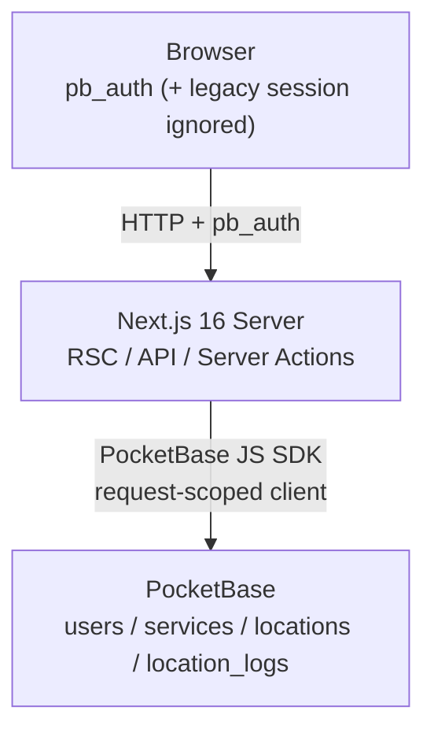
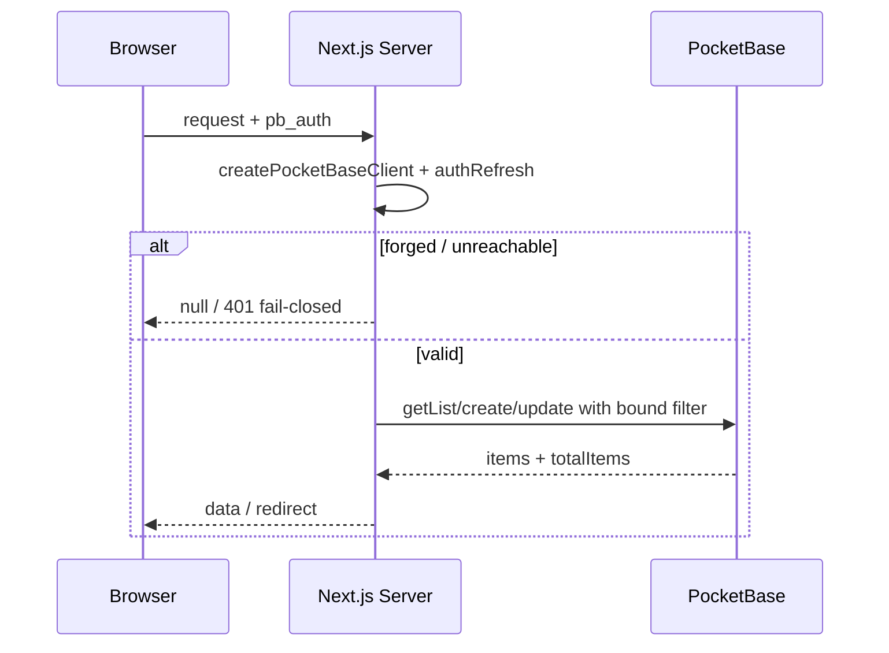

# ARCHITECTURE.md

> **Status**: Active | **Last updated**: 2026-08-24 | **Author**: jonasotoaguilar

## System Overview

ServiceFlow is a service-lifecycle management app for repair shops. **PocketBase is the only data and auth backend.** The Next.js 16 App Router serves server-rendered pages and REST API routes; every request builds a request-scoped PocketBase client from `POCKETBASE_URL` plus the `pb_auth` user session and enforces tenant isolation with bound filters and collection API rules. Schema lives in `pocketbase/v1.collections.json` and is applied out of band to the already-running local and Dokploy-managed PocketBase — this repository never hosts PocketBase.

## Architecture Pattern

**Chosen pattern**: Hybrid Server-Rendered SPA with BFF (Backend For Frontend) and request-scoped PocketBase.

Server Components render the page shell and auth gate; interactive sections (dashboard, locations, logs) use client components that call Next.js API routes or Server Actions. No module-scope PocketBase client and no admin SDK — each server request constructs `new PocketBase(getPocketBaseUrl())` and hydrates `authStore` only from `pb_auth`.

**Alternatives rejected**:

- **Shared singleton PocketBase**: leaks `authStore` across concurrent requests.
- **`loadFromCookie(full Cookie header)`**: would ingest the legacy `session` cookie beside `pb_auth`; rejected.

## System Map

Start paths: `docs/CODEBASE-GUIDE.md` → `lib/pocketbase.ts` → `lib/pocketbase-filter.ts` → `pocketbase/v1.collections.json` → this file. The guide's reading path and this map agree.

## Component Boundaries

| Area | File | Boundary |
|------|------|----------|
| Env | `lib/env.ts` | Zod `PocketBaseEnvSchema`; `getPocketBaseUrl()` validates `POCKETBASE_URL` as absolute `http`/`https`, fail-closed, no default, no `POCKETBASE_ADMIN_*` or Appwrite vars |
| Request client | `lib/pocketbase.ts` | `createPocketBaseClient()` per request: `await cookies()`, read `pb_auth` only, `authStore.save(token, record)` after `JSON.parse`; `saveAuthCookie`/`clearAuthCookie`/`clearLegacySessionCookie` set `httpOnly`, `sameSite=lax`, `path=/`, `secure` in prod, `expires` from JWT `exp` |
| Filters | `lib/pocketbase-filter.ts` | Pure templates `serviceListBinding`, `locationListBinding`, `logListBinding` + `applyBinding` sole `pb.filter` site; LIKE `~` on `clientName`/`invoiceNumber`/`rut`, status allowlist `pending|ready|completed|cancelled` |
| Auth identity | `lib/auth.ts` | `getAuthUser()` → `await cookies()` + `createPocketBaseClient()` + `await pb.collection("users").authRefresh()` before returning `{ id, email, name }`; forged/invalid signature or unreachable → `null` fail-closed; never reads `session` for identity |
| Auth actions | `app/actions/auth.ts` | `login`/`register`/`logout` validate `loginSchema`/`registerSchema` before PocketBase; `authWithPassword` / `collection("users").create` with `passwordConfirm`; success writes `pb_auth` and deletes `session` |
| Services | `lib/storage.ts` + `app/api/services/route.ts` | `getServices`/`saveService`/`updateService`/`deleteService` via `getList`/`create`/`update`/`delete`; native 15-char ids, `{ data, total, page, limit }`, `LIKE` search, bound `userId` |
| Locations | `app/actions/locations.ts` | `getLocations` via `locationListBinding`; create/update/toggle/delete with `LocationCreateSchema`/`LocationUpdateSchema`, `normalizeString` per-user duplicate, `isActive` guard, history delete guard |
| History | `app/actions/logs.ts` + `lib/storage.ts` movement | `getLocationLogs` via `logListBinding` (`fromLocationId = {:lid} || toLocationId = {:lid}`, `changedAt` bounds, sort `-changedAt`); movement `location_logs` created in `updateService` when `locationId` changes and not completing |
| Validation | `lib/schemas.ts` | `ServiceSchema`, `LocationCreateSchema`/`LocationUpdateSchema` (address optional trimmed max 200), `loginSchema`/`registerSchema` |
| Schema artifact | `pocketbase/v1.collections.json` | Versioned collections `users` (auth), `services`, `locations` (`address` optional), `location_logs` (`userId` required); text FKs not relations; tenant rules `userId = @request.auth.id`; no seed rows |
| Janitor | `proxy.ts` | Root `export function proxy` with matcher excluding `_next/static`, `_next/image`, `favicon.ico`, images; if `session` present, expires it `Max-Age=0` `path=/` and `NextResponse.next()`; never rewrites to Appwrite, never reads `pb_auth` |

No hosting, no container, no PocketBase Admin UI operation, and no schema apply from the Next.js process belong to this repository.

## Request Flow

## Data Architecture

| Collection | Key Fields | Indexes | Rule (all CRUD) |
|------------|------------|---------|-----------------|
| `users` (auth) | `email`, `password`, `name` | — | `list:null` `view:id=@request.auth.id` `create:""` (public) `update:id=@request.auth.id` `delete:null` |
| `services` | `userId`, `clientName`, `product`, `locationId`, `entryDate`, `status` | `userId`, `status`, `locationId`, `clientName`, `invoiceNumber`, `rut` | `userId = @request.auth.id` |
| `locations` | `name`, `userId`, `isActive`, `address` (optional), `createdAt`, `updatedAt` | `userId`, `name` | `userId = @request.auth.id` |
| `location_logs` | `userId`, `ServiceId`, `fromLocationId`, `toLocationId`, `changedAt` | `userId`, `ServiceId`, `fromLocationId`, `toLocationId` | `userId = @request.auth.id` |

- **Ids**: creates omit `id`; PocketBase assigns 15-char ids. Types keep `id: string`.
- **Tenant isolation**: app binds `userId = {:uid}` on every list, sets `userId` from server identity on create, and ownership-checks before update/delete; rules deny cross-tenant access even if app filter is bypassed.
- **Pagination**: `{ data, total, page, limit }` from `getList(page, perPage, { filter, sort })`; `perPage` is `limit`.
- **Search**: `~` (LIKE) with `{:search}` only; `applyBinding` is the only `pb.filter` call site.
- **Cache**: `revalidatePath` after location mutations; pages fetch fresh; no SWR layer yet.

## API Architecture

- **Style**: REST `GET/POST/PUT/DELETE /api/services` + Server Actions for auth, locations, logs.
- **Auth**: `pb_auth` cookie only; unauthenticated RSC → `redirect("/login")`, API → `401 { error: "Unauthorized" }`.
- **Validation**: server Zod before any PocketBase call; invalid → `400 { error: "Validation failed" }` with no write.
- **Errors**: never leak PB internals, filter strings, or hostnames; deterministic Spanish messages for bad credentials and duplicate email.

## Non-Functional Requirements

| Category | Target |
|----------|--------|
| Performance | `getList` with bound index; LIKE over small personal dataset; page load <2s |
| Availability | Depends on managed PocketBase SLA; fail-closed when unreachable |
| Security | `pb_auth` httpOnly/lax/path/secure-in-prod; tenant rules `userId = @request.auth.id`; `{:param}` only; `authRefresh` required; legacy `session` ignored/deleted |
| Observability | Server console; never logs `pb_auth` value or token |
| Deployment | Docker standalone via `Dockerfile`; env is `POCKETBASE_URL` only |

## Key Decisions and ADRs

Durable choices live in `openspec/changes/migrate-appwrite-to-pocketbase/design.md` ADRs and are linked here per repo convention (`PRD.md`/`ARCHITECTURE.md` at root, no parallel `docs/adr` scheme).

| Decision | Rationale | ADR |
|----------|-----------|-----|
| Request-scoped client, `pb_auth` only, `authRefresh` before identity | Prevents cross-request leak and forged `exp`/tampered `id` auth | ADR-1 |
| Runtime env is only `POCKETBASE_URL` | No admin secrets in app; fail-closed on missing/invalid | ADR-2 |
| Versioned `pocketbase/v1.collections.json`, operator apply out of band, no in-repo PocketBase | App never hosts or migrates schema; explicit Admin UI import/transcription + checklist | ADR-3 |
| Text FKs, not relation fields | Avoids cascade-delete vs `hasHistory` guard | ADR-4 |
| Bound filter builder, LIKE `~`, envelope `{ data, total, page, limit }` | Injection-safe search, stable pagination | ADR-5 |
| Ordered writes, no multi-record transaction | `updateService` → then `location_logs`; delete logs first then service; no rollback invention | ADR-6 |
| Strangler on this branch, empty start, native ids | One backend at cutover; no import/mapping | ADR-7 |
| Zod at every untrusted edge | Env, auth, service, location validated on server | ADR-8 |

No ADR is deleted; supersession would be recorded explicitly if needed.

## Failure Modes and Recovery

| Failure | Impact | Mitigation |
|---------|--------|------------|
| PocketBase unreachable | Reads/writes fail | Fail closed `null`/`401`/generic error; no anonymous success; no Appwrite fallback |
| Forged `pb_auth` (future `exp`, tampered `id`, bad sig) | Impersonation attempt | `authRefresh` rejects → `null`/`401`; RSC verifies, Action/Route may persist refreshed cookie only when valid |
| Schema not applied on target PocketBase | Missing collections/rules | Checklist before flipping `POCKETBASE_URL`: 4 collections, `address` optional, `location_logs.userId` required, 0 business rows, tenant rules present, `users` create public + list/delete locked |
| Wrong tenant id in client payload | Ownership hijack | Server ignores client `userId`; uses `getAuthUser().id` |
| Cutover smoke fails | Users cannot register/list | Redeploy last Appwrite-backed image with prior env; PocketBase rows not copied back; `pb_auth` invalid for Appwrite — expected |

## Historical Transition

Appwrite (Admin SDK, `lib/appwrite.ts`, `node-appwrite`/`appwrite`, `scripts/setup-appwrite.ts`, `DB_ID`/`COLLECTIONS`/`Query`/`ID`, and the unauthenticated Appwrite proxy rewrite) was the live backend before this change. It was left untouched on its cloud project until acceptance — no data import, no dual-write, no `session` bridge. After product slices WU1–WU6d, docs WU7, and this contracts slice WU8, Appwrite remains only as the historical rollback target described in `PRD.md` and `README.md`. WU9 deletes `check_or.ts`/`lint_output.txt`; WU10 (acceptance-gated) deletes Appwrite code/deps and the leftover `session` janitor. Do not configure Appwrite for new work and do not describe the old proxy rewrite as live.

## Reading Path and Operational Boundaries

1. `docs/CODEBASE-GUIDE.md` (navigational index, 90-second model, 7 seams)
2. `lib/env.ts` → `lib/pocketbase.ts` → `lib/pocketbase-filter.ts`
3. `pocketbase/v1.collections.json` (canonical schema)
4. `lib/auth.ts` → `app/actions/auth.ts` → `lib/storage.ts` / `app/actions/locations.ts` / `app/actions/logs.ts`
5. This file for the system map; `PRD.md` for product intent

Operational boundaries: no PocketBase binary/image/volume/TLS/backup/Dokploy spec in this repo; no `pb_hooks`; no admin token env; no hosting runbook; applying the artifact and flipping `POCKETBASE_URL` are separate explicit operator steps.

## Known Risks

- Operator applies wrong tenant rules — mitigated by artifact tests (`tests/schema-artifact.test.ts`) and app-level `userId` filters with two-tenant tests.
- `LIKE` `~` is not full-text ranking — accepted for personal scale.
- Test coverage is Vitest unit only; no E2E.
