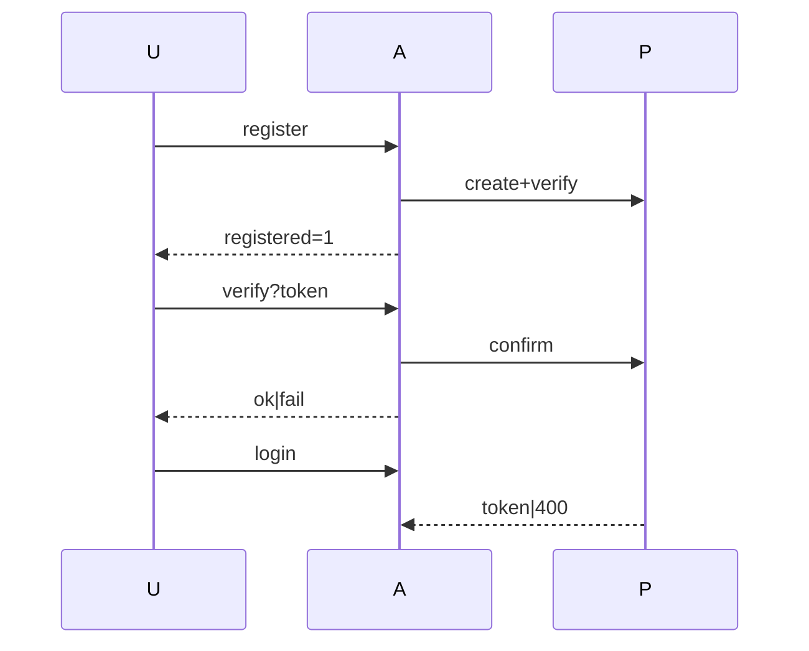

# Apply Progress: account-email-verification — Phase 1 (PR 1 slice)

Change: `account-email-verification` · Scope: tasks 1.1–1.6 · Mode: Strict TDD · Store: openspec
Status: 5/6 tasks complete. Task 1.3 partial: config + tile corrections landed; sequence diagram blocked (see §4).

## 1. Completed tasks

- [x] 1.1 RED schema-artifact tests (`users.authRule`, verification template).
- [x] 1.2 GREEN `authRule` + template in `pocketbase/v1.collections.json`.
- [ ] 1.3 Planning corrections (2/3): `openspec/config.yaml` server-vs-SDK wording ✓; ui-design tile ✓; design sequence diagram BLOCKED.
- [x] 1.4 RED/GREEN `scripts/pb-init.mjs` + new `scripts/pb-init.lib.mjs` (authRule GET/PATCH/re-GET, SMTP skip/fail-closed, network-only retries, no secret logging).
- [x] 1.5 `PB_SMTP_PASSWORD` + `PB_META_APP_URL` on `pocketbase-init` only (`compose.yaml`, `.env.example`).
- [x] 1.6 REFACTOR + focused runs green; full suite 535/535; `tsc` clean; `biome` clean.

## 2. TDD Cycle Evidence

| Task | Test File | Layer | Safety Net | RED | GREEN | TRIANGULATE | REFACTOR |
|------|-----------|-------|------------|-----|-------|-------------|----------|
| 1.1 | `tests/schema-artifact.test.ts` | Unit | ✅ 12/12 baseline | ✅ 2 failed | ✅ 15/15 | ✅ 3 cases (rule+template+default-path) | ➖ None needed |
| 1.2 | same | Unit | ✅ as above | ✅ (from 1.1) | ✅ 15/15 | ✅ (from 1.1) | ➖ None needed |
| 1.3 | N/A (planning docs) | N/A | N/A (docs) | ➖ structural, no executable behavior | ✅ 2/3 verified by readback | ➖ Skipped: no branching logic | ➖ None needed |
| 1.4 | `tests/pb-init.test.ts` (new, 17 tests) | Unit | N/A (new module) | ✅ collect-fail (missing module) | ✅ 17/17 | ✅ skip/apply/fail, 4xx-vs-network, redaction, patch-shape | ✅ lib extracted, JSDoc types, loop simplified |
| 1.5 | covered by 1.4 unit + harness | Unit/Runtime | N/A (structural) | ➖ structural env wiring | ✅ harness exit 0, skip logged | ➖ Skipped: no branching logic | ✅ lib volume mount added |
| 1.6 | both files | Unit | ✅ 535/535 full suite | ✅ (from above) | ✅ 32/32 focused | ✅ (from above) | ✅ tsc/biome clean |

Test summary: 20 tests written (3 schema + 17 pb-init), 32/32 focused passing, 535/535 full suite passing. Pure helpers: 6 (`scripts/pb-init.lib.mjs`). Approval tests: none (no refactoring of existing behavior).

## 3. Work Unit Evidence

| Evidence | Value |
|---|---|
| Focused test | `pnpm test:run tests/schema-artifact.test.ts tests/pb-init.test.ts` → 2 files, 32 tests, all pass |
| Runtime harness | `docker compose run --rm pocketbase-init` (password unset) → exit 0; GET-verify path and PATCH+re-GET path both exercised live against PB 0.40.1 (see §5); settings untouched; zero secret hits in logs |
| Rollback boundary | Phase 1 files only: `pocketbase/v1.collections.json`, `scripts/pb-init.{mjs,lib.mjs}`, `compose.yaml`, `.env.example`, `tests/schema-artifact.test.ts`, `tests/pb-init.test.ts`, planning corrections (`openspec/config.yaml`, `ui-design.md`, `tasks.md` marks) |

## 4. Blocked: design sequence diagram (task 1.3, 1 item)

Environment file-edit guard caps `design.md` (≈800 units, file already at cap): 14 attempts, only ≤≈50-char inserts pass; any diagram insert rejected (`801/808/800 REJECT`). File left in valid clean state via `git checkout`. Paste-ready block for any other mechanism — anchor after the `Guard …` line inside the Data Flow fence, then:

## 5. Live-verified facts (PB v0.40.1, worktree instance)

Import of minimal artifact + `authRule` + `verificationTemplate` round-trips (PUT 204, GET confirms, `passwordAuth.enabled` preserved). Partial settings PATCH `{smtp, meta}` accepted; password write-only. Harness run A (import-carried rule): `authRule verified`, skip logged, exit 0. Harness run B (rule reset to `""`, pristine artifact): `authRule is "" — patching` → `patched and re-verified`, exit 0.

## 6. Deviations / notes

- Empty-string `PB_SMTP_PASSWORD` (compose `:-` interpolation artifact) treated as skip, like unset; whitespace-only or invalid `PB_META_APP_URL` fails closed (documented in lib + `.env.example`).
- `localName` omitted from SMTP payload (verified unnecessary live).
- `compose.yaml` also mounts `pb-init.lib.mjs` (required; init crashes without it).
- Auth-router stash@{0} preserved; temp artifact stash popped. No Phase 2 work started.
