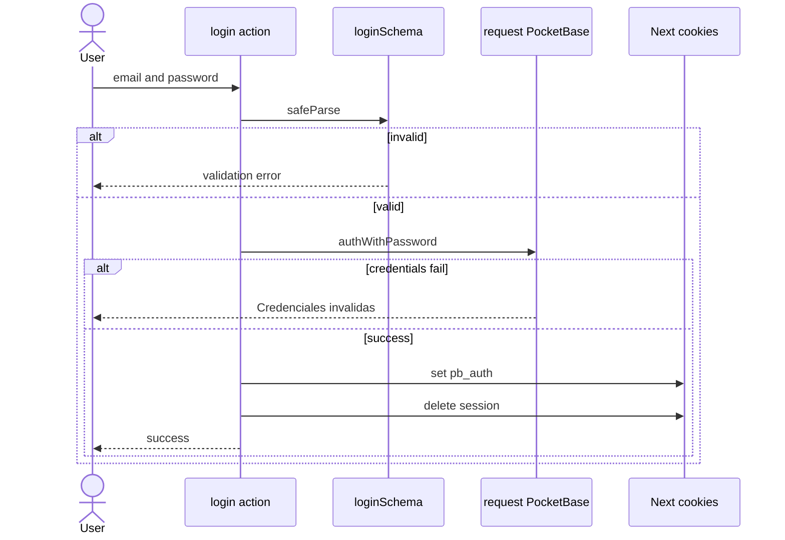
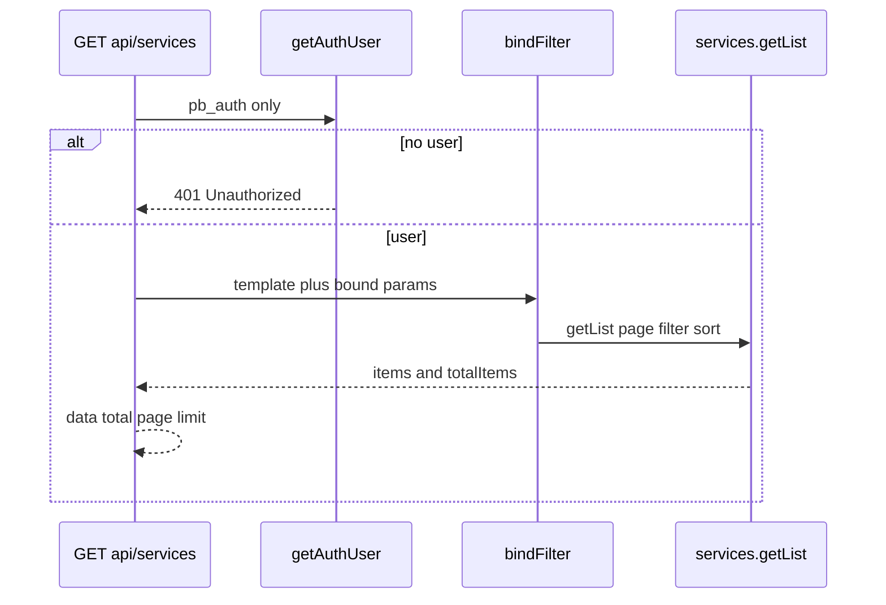
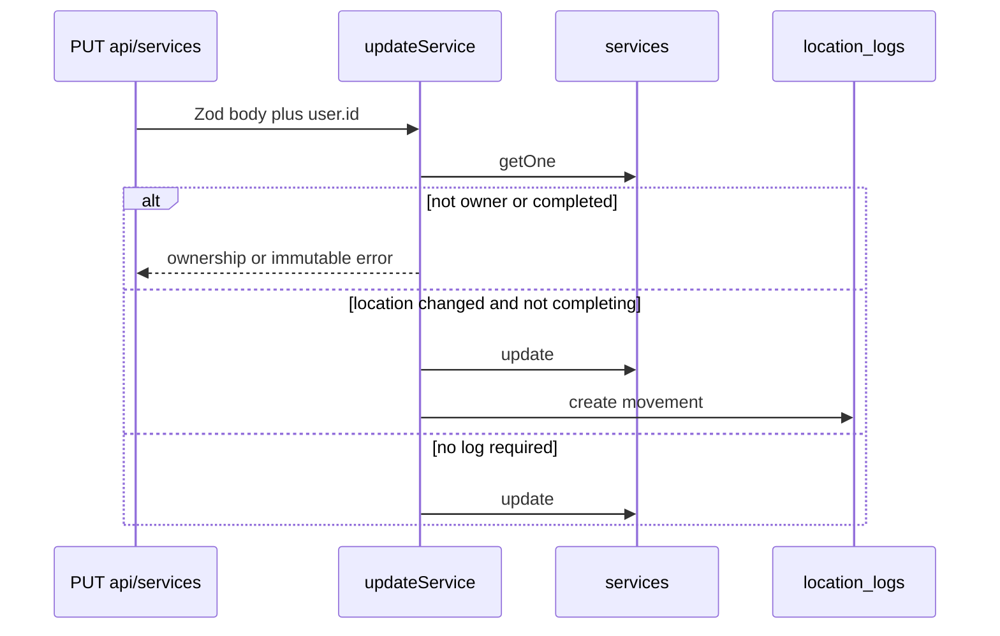
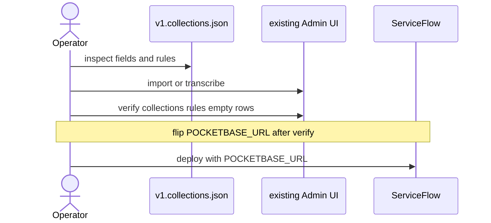
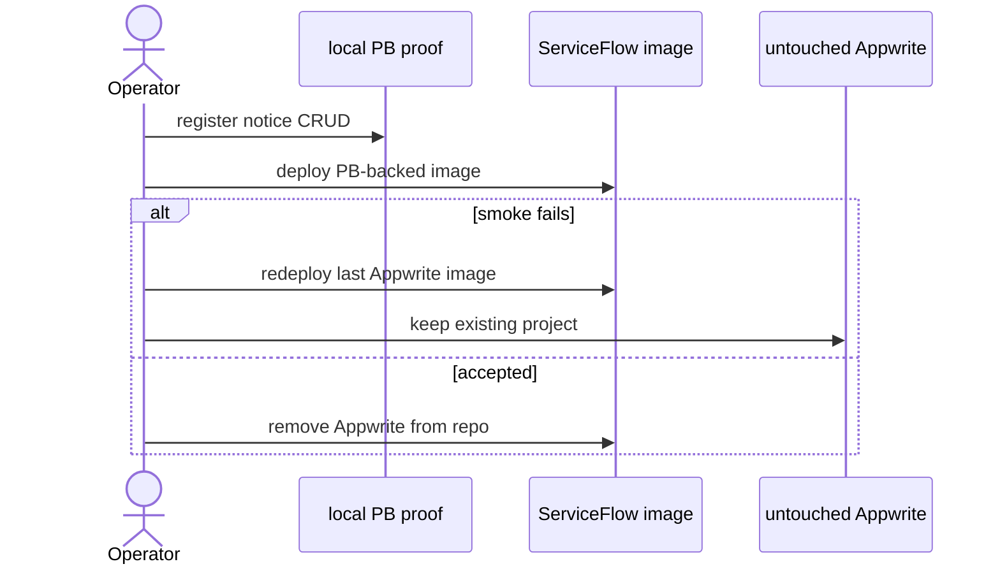

# Design: PocketBase replaces Appwrite

ServiceFlow will talk only to PocketBase through a request-scoped JS SDK client, a `pb_auth` httpOnly cookie, and Zod-validated boundaries. Schema lives in a versioned in-repo collection JSON artifact that Jona applies by hand to the already-running local and Dokploy PocketBase instances. The Next.js process never uses admin credentials, never hosts PocketBase, never imports Appwrite data, and never shares an `authStore` across requests.

This change is the ServiceFlow Next.js app (not `packages/coding-agent`). Appwrite stays in the tree until an explicit acceptance gate; it is rollback, not a dual-write path.

## Quick path

1. Add `pocketbase/v1.collections.json` plus `lib/env.ts`, `lib/pocketbase.ts`, and `lib/pocketbase-filter.ts`. Prove them with Vitest mocks only.
2. Rewrite auth onto `pb_auth`, clear leftover `session`, show the temporary empty-start notice, and point `getLocations` at PocketBase.
3. Rewrite services and location history against native 15-character ids, bound `{:param}` filters, and the existing `{ data, total, page, limit }` envelope.
4. Operator applies the artifact on the existing PocketBase, verifies collections and tenant rules, then flips `POCKETBASE_URL` as a separate step.
5. After the smoke gate, delete Appwrite from this repo. Do not delete the Appwrite cloud project from this change.

## Spec-gate notes addressed

Nonblocking spec-gate comments are closed here, not deferred to tasks:

| Note | Design response |
| --- | --- |
| Name Zod as the boundary validator | Zod is the only input/env validator. Server actions call `loginSchema` / `registerSchema` / new location schemas before any PocketBase call. `POST`/`PUT` `/api/services` keep `ServiceSchema.safeParse`. `POCKETBASE_URL` is parsed by `PocketBaseEnvSchema`. Client `zodResolver` is UX only. |
| Normative tenant-rule pointer | Collection API rules are defined once in `pocketbase-schema` (this document's schema tables are that design). `services-lifecycle` and `locations-history` add app-level ownership only. They MUST NOT invent a second rule dialect. |

## Current seams (verified)

| Seam | Today | After |
| --- | --- | --- |
| `lib/appwrite.ts` | Admin SDK + module-scope `databases` + `session` cookie | Deleted after acceptance. Replaced by `lib/pocketbase.ts` |
| `lib/auth.ts` | `account.get()` via session client | `getAuthUser()` from request-scoped `authStore` |
| `app/actions/auth.ts` | Admin-key `createPublicClient()`, no server Zod | Public `users` auth, server Zod, `pb_auth` |
| `lib/storage.ts` | Appwrite `Query` + pre-set document ids | Bound PocketBase `getList` / `create` / `update` / `delete` |
| `app/actions/locations.ts`, `logs.ts` | Admin `databases` + ad-hoc name checks | Same actions, PocketBase + Zod location schemas |
| `app/api/services/route.ts` | `crypto.randomUUID()` on create | No client/server id; PocketBase assigns `id` |
| `scripts/setup-appwrite.ts` | Canonical Appwrite schema; `Role.any()` | Not used. Schema artifact replaces it |
| root `proxy.ts` (not `app/proxy.ts`) | Unauthenticated rewrite of `/api/proxy` to Appwrite | Replaced in WU 2c (pre-split from old WU2 forecast 574–737) by a cookie-janitor `proxy` that only expires leftover `session` on app/API requests. Matcher excludes `_next/static`, `_next/image`, `favicon.ico`, and image extensions. Deleted in WU 10 with the leftover-session path. Old WU2 was corrected to 574–737 and split into 2a/2b/2c before acquire with no size exception |

`lib/types.ts` stays. `id` remains a string; values become PocketBase 15-character ids.

## Architecture

```text
Browser
  └─ httpOnly pb_auth (and leftover session, ignored + deleted)
        │
        ▼
Next.js 16 App Router (Node runtime)
  Zod boundary: env, login/register, services, locations
  getAuthUser() + ownership checks
  lib/pocketbase-filter.ts  →  {:param} templates only
  createPocketBaseClient()  →  new PocketBase(url) per request
        │
        ▼
Existing PocketBase (local :8090 or Dokploy)
  users / services / locations / location_logs
  API rules: userId = @request.auth.id
```

No admin client, no module-scope PocketBase, no Appwrite locator fallback.

## ADR-style decisions

### ADR-1 — Request-scoped PocketBase client, `pb_auth` only with server validation

**Status:** Accepted (amended 2026-08-22 — gate FAIL: `authRefresh` required)

**Context:** The JS SDK keeps a mutable `authStore` on the client instance. A process-wide singleton would leak user A onto user B's concurrent RSC/action. The current `lib/appwrite.ts` already exports a module-scope admin `databases` client; that pattern must not be copied. Expiry-only `authStore.isValid` is insufficient — a forged cookie with future `exp`/tampered record would otherwise be trusted.

**Decision:** Every server request that talks to PocketBase constructs `new PocketBase(getPocketBaseUrl())`. Request-client hydration MUST `await cookies()` (Next.js 16 async cookies API; never call `cookies()` synchronously) and read only the `pb_auth` cookie. Hydrate `authStore` only from that value via official `authStore.save(token, record)` after JSON-parsing the cookie, then MUST call `pb.authRefresh()` (or equivalent server validation) before `getAuthUser` returns an identity. On `authRefresh` success use the refreshed record; on forged/tampered record or invalid signature → unauthenticated (`null`/401); on transport failure/unreachable → fail closed (no identity, no Appwrite admin fallback). Ignore query strings, bodies, and the legacy `session` cookie. If the cookie is missing or not well-formed, leave the client unauthenticated and do not throw an identity. No cache yet. Verification is required; refreshed cookie persistence is only allowed in mutable Server Action/Route Handler (`await cookies()` `set`); RSC can verify but MUST NOT attempt to persist cookies (Next.js RSC cookie-write limitation).

**Sources:** [Authentication](https://pocketbase.io/docs/authentication), [JS SDK](https://github.com/pocketbase/js-sdk) SSR guidance that a new client is required per request so `authStore` does not leak.

**Alternatives:**

| Option | Tradeoff | Why rejected |
| --- | --- | --- |
| Module-scope `new PocketBase` | Fast, matches today's Appwrite singleton | Cross-request identity leak |
| `loadFromCookie(entire Cookie header)` | Official helper | Would see `session` sitting next to `pb_auth`; we must not treat `session` as PocketBase auth |
| `authRefresh()` on every `getAuthUser` | Server-validates token before trusting identity; refreshed record is authority; no cache yet | Required for security — RSC verifies but persists refreshed cookie only in Server Action/Route (RSC cookie-write limitation); PB failure → fail closed (`null`/401), extra network accepted |

`getAuthUser` MUST `await cookies()`, hydrate via `authStore.save`, then `await pb.authRefresh()` to validate before returning `{ id, email, name }` from the refreshed record; on forged/invalid → `null`, on failure/unreachable → `null` fail closed with `401` where applicable, never raw-cookie identity nor Appwrite fallback. RSC callers verify but do not persist the refreshed cookie; persistence only in Server Action/Route Handler. No cache yet.

### ADR-2 — Runtime env is only `POCKETBASE_URL`

**Status:** Accepted

**Context:** Specs forbid admin email/password/token env vars. Exploration mentioned them only as an inference for privileged ops.

**Decision:** Zod `PocketBaseEnvSchema` accepts a single non-empty absolute `http` or `https` URL from `POCKETBASE_URL`. Missing, empty, or invalid values throw a config error. Callers map that to unauthenticated / generic failure. The app never reads `NEXT_PUBLIC_APPWRITE_*`, `APPWRITE_API_KEY`, or any `POCKETBASE_ADMIN_*` / token name. This design does not invent admin secret names.

**Alternatives:** Admin token for schema apply inside Next.js — rejected by `pocketbase-access` and `pocketbase-schema`. Feature-flag dual backend — rejected; one backend on this branch after the first slice wires up.

### ADR-3 — Versioned collection JSON, operator apply, no in-repo PocketBase

**Status:** Accepted

**Context:** Spec allows JS migrations or exported collection JSON. Jona already runs PocketBase under Dokploy. This repo must not add a binary, container, volume, proxy, TLS, backup job, or Dokploy lifecycle. PocketBase JS/Go migration APIs changed across 0.22 → 0.23 (`dao` vs `app`), and the live instance version is not pinned here.

**Decision:** Canonical artifact is `pocketbase/v1.collections.json`: a committed, hand-authored snapshot of `users`, `services`, `locations`, and `location_logs` (fields, indexes, rules). It creates no business rows.

Operator apply (privileged, out of band, using the Admin UI the operator already has):

1. Open the already-running PocketBase Admin UI (local `127.0.0.1:8090/_/` or the existing Dokploy URL).
2. If this PocketBase version can import collections and the file is accepted, import `pocketbase/v1.collections.json`.
3. If import is unavailable or rejects the file, transcribe fields, indexes, and rules from the artifact by hand. Update the default `users` auth collection; do not create a second auth collection.
4. Run the verification checklist below.
5. Only after verification, set ServiceFlow `POCKETBASE_URL` and deploy. Apply and URL flip are separate steps.

This repo never logs in as admin and never applies schema at runtime.

**Sources:** [Collections](https://pocketbase.io/docs/collections), [API rules and filters](https://pocketbase.io/docs/api-rules-and-filters), [JS migrations](https://pocketbase.io/docs/js-migrations), [Go migrations](https://pocketbase.io/docs/go-migrations), [Going to production](https://pocketbase.io/docs/going-to-production). Admin UI import menu path and JSON compatibility across versions are **(inference)** — that is why transcription is a first-class fallback and verification is mandatory.

**Alternatives:**

| Option | Tradeoff | Why rejected |
| --- | --- | --- |
| JS `pb_migrations/*.js` | Real up/down, official | Version-coupled; needs files on the PB working directory plus restart — operates the instance from this repo |
| Go migrations | Same as JS, heavier | Needs Go/rebuild of a binary we do not own |
| App admin API apply | Automatable | Requires runtime admin credentials — forbidden |
| docker-compose / Dokploy spec in this repo | Convenient local bring-up | Explicit non-goal |

### ADR-4 — String ids, not PocketBase relation fields

**Status:** Accepted

**Context:** Spec leaves `locationId` / `ServiceId` / `fromLocationId` / `toLocationId` as a design detail. They must store PocketBase-native ids.

**Decision:** Store those foreign keys (and denormalized `userId`) as required **text** fields holding the 15-character id. Do not use relation fields.

**Sources:** [Collections](https://pocketbase.io/docs/collections) documents relation fields and cascade-delete options. Cascade would fight the location `hasHistory` delete guard.

**Alternatives:** Relation + `expand` would drop the locMap joins but risks cascade deletes and couples filters to expand syntax. Rejected for a personal dataset that already batches lookups.

### ADR-5 — Bound filter builder, LIKE search, stable list envelope

**Status:** Accepted

**Decision:** `lib/pocketbase-filter.ts` builds a constant template plus a params object. Production applies it with the official SDK helper `pb.filter(template, params)` ([API rules and filters](https://pocketbase.io/docs/api-rules-and-filters), [JS SDK](https://github.com/pocketbase/js-sdk)). Search uses `~` (SQLite LIKE). Status tokens are allowlisted to `pending|ready|completed|cancelled` before binding. `getList(page, perPage, { filter, sort })` maps `items`/`totalItems` to `{ data, total, page, limit }`. Default `page=1`, `limit=20`. Sort `entryDate` or `-entryDate`; logs use `-changedAt`.

Raw search text MUST never be concatenated into the template string. Tests assert the template is invariant under metacharacters.

### ADR-6 — No multi-record transaction; ordered writes + compensation

**Status:** Accepted

**Decision:** PocketBase's public record API is one HTTP request per write. **(inference, labeled: no documented multi-collection transaction for the JS SDK / Web API on [FAQ](https://pocketbase.io/faq) or going-to-production; do not add `pb_hooks` to this repo.)**

| Operation | Order | If the second write fails |
| --- | --- | --- |
| Service update + movement log | Update service, then create `location_logs` | Service already moved; return a generic error; do not invent a rollback. Same non-atomicity as today's Appwrite path |
| Service delete + its logs | Delete matching logs first; abort if any log delete fails; then delete the service | Service remains, retry is safe. Opposite order can orphan logs and violate "delete service removes its logs" |
| Completing + location change | Update service only | No log, per `locations-history` |

Do not add PocketBase hooks to fake atomicity.

### ADR-7 — Strangler on the branch, one backend at cutover, no import

**Status:** Accepted

**Decision:** This branch rewrites seams onto PocketBase. Appwrite Cloud/project is not read, written, or deleted. No dual-write, no password import, no id map. Local proof first. Production keeps the last Appwrite-backed image until the smoke gate. After acceptance, delete Appwrite code and deps from this repo only.

### ADR-8 — Zod at every untrusted edge

**Status:** Accepted

**Decision:** Name Zod explicitly (spec-gate). Validate env, auth forms, service JSON, and location writes on the server. PocketBase responses are untrusted third-party data: map through pickers (`id`, known fields) before returning to UI. Internal functions trust those mapped types.

## Schema artifact

Path: `pocketbase/v1.collections.json`.

`users` is the built-in auth collection. The artifact describes the required rules and the display `name` field. Operator updates the existing collection.

Collection names are lowercase PocketBase names (`services`, `locations`, `location_logs`). Empty start makes the Appwrite `Services` / `location-logs` spellings unnecessary.

### `users` (auth)

| Field | Type | Required | Notes |
| --- | --- | --- | --- |
| email | auth email | yes | Built-in |
| password | auth secret | yes on create | bcrypt inside PocketBase ([Authentication](https://pocketbase.io/docs/authentication)); Appwrite hashes are not portable |
| name | text | yes | Display name |

| Rule | Expression |
| --- | --- |
| list | `null` (locked) |
| view | `id = @request.auth.id` |
| create | `""` (public self-registration) |
| update | `id = @request.auth.id` |
| delete | `null` (locked) |

`""` vs `null` follows current PocketBase rule semantics: empty string is public, null is denied ([API rules and filters](https://pocketbase.io/docs/api-rules-and-filters)). Operator verification confirms public register works and unauthenticated list/delete do not.

### `locations`

| Field | Type | Required | Default | Notes |
| --- | --- | --- | --- | --- |
| name | text 255 | yes | | |
| userId | text 15 | yes | | Owner PocketBase user id, string not relation |
| isActive | bool | no | `true` | |
| address | text 200 | no | | First-class; Appwrite setup omitted it |
| createdAt | date | yes | | App sets ISO timestamp |
| updatedAt | date | yes | | App sets ISO timestamp |

Indexes: `userId`, `name`.

Do not rely on system `created`/`updated` names. **(inference: those system names exist, but spec fields are `createdAt`/`updatedAt`.)**

### `services`

| Field | Type | Required | Default |
| --- | --- | --- | --- |
| userId | text 15 | yes | |
| invoiceNumber | text 255 | no | |
| clientName | text 255 | yes | |
| rut | text 50 | no | |
| contact | text 255 | no | |
| email | text 255 | no | |
| product | text 255 | yes | |
| failureDescription | text 5000 | no | |
| sku | text 255 | no | |
| locationId | text 15 | yes | id of a `locations` row |
| entryDate | date | yes | |
| deliveryDate | date | no | |
| readyDate | date | no | |
| cancellationDate | date | no | |
| status | text 50 | no | `pending` |
| repairCost | number | no | `0` |
| notes | text 5000 | no | |

Indexes: `userId`, `status`, `locationId`, `clientName`, `invoiceNumber`, `rut`. These are ordinary indexes, not Appwrite full-text. `~` is LIKE ([API rules and filters](https://pocketbase.io/docs/api-rules-and-filters)).

### `location_logs`

| Field | Type | Required | Notes |
| --- | --- | --- | --- |
| userId | text 15 | yes | Denormalized owner; required for history filters |
| ServiceId | text 15 | yes | Service id (capital S kept to match `lib/types.ts`) |
| fromLocationId | text 15 | yes | |
| toLocationId | text 15 | yes | |
| changedAt | date | yes | |

Indexes: `userId`, `ServiceId`, `fromLocationId`, `toLocationId`.

### Tenant API rules (normative)

For `services`, `locations`, and `location_logs`, every CRUD rule is:

```text
userId = @request.auth.id
```

That single expression is the normative PocketBase ACL. It lives in `pocketbase-schema` / this artifact. App code still:

1. Requires `getAuthUser()`.
2. Binds `userId = {:uid}` on every list.
3. Sets `userId` from the server identity on create; ignores client-owned `userId`.
4. Refuses update/delete when the stored `userId` ≠ current user.

Unauthenticated PocketBase HTTP access is denied by the locked/filtered rules. Superuser Admin UI bypass is operator-only and out of runtime.

### Native ids

Creates omit `id`. PocketBase generates the 15-character record id ([Collections](https://pocketbase.io/docs/collections)). Application types keep `id: string`. No UUID helper, no Appwrite `$id` map.

### Operator verification checklist

- [ ] `users`, `services`, `locations`, `location_logs` exist.
- [ ] `locations.address` exists and is optional.
- [ ] `location_logs.userId` exists and is required.
- [ ] Business collections have zero rows after apply.
- [ ] Tenant rules are `userId = @request.auth.id` on list/view/create/update/delete for the three business collections.
- [ ] `users` create is public; list/delete of other users is denied.
- [ ] Unauthenticated Admin-API-equivalent list of `services` is denied (guest request, not superuser).
- [ ] `POCKETBASE_URL` has not been flipped yet.

## Auth, cookies, notice, errors

### Cookie contract

| Name | Role |
| --- | --- |
| `pb_auth` | Only session. Value is `JSON.stringify({ token, record })` from `authStore`. Never logged. |
| `session` | Legacy Appwrite. Never read for identity. Deleted whenever seen. |

Write flags: `httpOnly`, `sameSite=lax`, `path=/`, `secure` iff `NODE_ENV === "production"`. `expires` is the JWT `exp` when that claim parses as a unix timestamp; otherwise omit `expires` (browser session) so we do not set a lifetime longer than we can prove. JWT `exp` parsing is **(inference)** from typical PocketBase auth tokens ([Authentication](https://pocketbase.io/docs/authentication) describes token + record; it does not require us to document the JWT layout). `authStore.isValid` remains the identity gate.

Every Next.js 16 server context that touches cookies MUST `await cookies()` before `get` / `set` / `delete`. That includes request-client hydration, `getAuthUser`, login, register, logout, and the cookie save/delete helpers in `lib/pocketbase.ts`. Do not call `cookies()` synchronously.

Register: Zod `registerSchema` → `collection("users").create({ email, password, passwordConfirm: password, name })` → `authWithPassword` → `await cookies()` to write `pb_auth` and delete `session`. `passwordConfirm` is required by PocketBase user create ([Authentication](https://pocketbase.io/docs/authentication)).

Login: Zod `loginSchema` → `authWithPassword` → `await cookies()` to write `pb_auth` and delete `session`.

Logout: `await cookies()` to delete `pb_auth` and `session`, then `redirect("/login")`.

Cookie helpers (`saveAuthCookie`, `clearAuthCookie`, `clearLegacySessionCookie`) MUST `await cookies()` and run only from Server Actions and Route Handlers. Next.js Server Components can `await cookies()` to read but cannot legally `set` / `delete` (Next 15+/16). `pocketbase-access` still requires every response that saw `session` to delete it, including `GET /dashboard`.

Therefore WU 2c (slice of pre-split 574–737 WU2) **replaces** the current Appwrite rewrite at **root** `proxy.ts` (never `app/proxy.ts`; Next.js 16 auto-loads the repo-root proxy entrypoint) with a cookie janitor. The janitor's only job: if the request has a `session` cookie, expire it (`Max-Age=0`, `path=/`) on the `NextResponse` and return `NextResponse.next()`. It MUST NOT rewrite or proxy to Appwrite, MUST NOT read `pb_auth`, MUST NOT authenticate, and MUST NOT forward or rewrite arbitrary paths. It uses the proxy request/response cookie API, not `await cookies()` from `next/headers`. Old WU2 was forecast 574–737 provider lines via source-driven preflight before any acquire and was pre-split into 2a/2b/2c to preserve auto-chain/400 without size exception.

Safe Next.js 16 matcher — broad enough for app pages and `/api/*`, excluding static/image/favicon assets:

```ts
// proxy.ts (repository root)
export const config = {
  matcher: [
    "/((?!_next/static|_next/image|favicon.ico|.*\\.(?:svg|png|jpg|jpeg|gif|webp|ico)$).*)",
  ],
};
```

That matcher runs on `/`, `/login`, `/register`, `/dashboard`, `/locations`, `/locationLogs`, `/api/services`, and other app/API requests. It skips `/_next/static/*`, `/_next/image/*`, `/favicon.ico`, and common image files. Keep this repo's Next 16 convention: `export function proxy` plus `config.matcher` on the root file.

Login, register, logout, and `/api/services` also `await cookies()` and delete `session` as defense in depth. After acceptance, WU 10 deletes this root janitor with the rest of the leftover-session path. Project-contracts forbids documenting the old unauthenticated Appwrite rewrite as live behavior.

### Empty-start notice

Static Spanish copy on `/login` and `/register` (satisfies login, registration, or first session):

> Este entorno PocketBase comienza vacío. Los tickets y sedes anteriores de Appwrite no aparecerán.

No import, reset, or restore control. Remove the banner after cutover communication — it is not a permanent product surface.

### Error mapping (one shape)

Auth actions keep `{ success: true } | { error: string }`.

| Cause | Caller sees |
| --- | --- |
| Zod login/register/location failure | Validation `error` string from Zod; no PocketBase call |
| Bad login credentials or unknown email | `Credenciales inválidas` |
| Duplicate register email / PB 400 unique | `No se pudo crear la cuenta. El correo puede estar en uso.` |
| PB transport / unexpected | Generic `Error al iniciar sesión` / `Error al registrarse` / existing location generic strings |
| `/api/services` unauthenticated | `401 { error: "Unauthorized" }` |
| `/api/services` Zod failure | `400 { error: "Validation failed" }` |
| Missing id on PUT/DELETE | `400` |
| Ownership / completed immutable | Failure without PB exception text |
| Unexpected API | `500` generic string |

Never return stack traces, filter strings, hostnames, or raw PocketBase messages.

## Query builder

```ts
// lib/pocketbase-filter.ts — templates are compile-time constants
serviceListBinding({ userId, search, status, locationId })
// filter:
//   userId = {:uid}
//   && (clientName ~ {:search} || invoiceNumber ~ {:search} || rut ~ {:search})  // if search
//   && (status = {:st0} || status = {:st1} ...)                                  // allowlisted
//   && locationId = {:locationId}                                                // if set

locationListBinding({ userId, onlyActive })
logListBinding({ userId, locationId, startDate, endDate })
// locationId → (fromLocationId = {:lid} || toLocationId = {:lid})
```

`applyBinding(pb, binding)` is the only place that calls `pb.filter`. Storage never interpolates.

Join enrichment stays batched: collect ids from the page, `getList`/`getFullList` with bound `id = {:id0} || ...`, build `locMap`. Empty id sets skip the fetch.

## Service and location lifecycle

Preserve today's product rules, now on PocketBase.

`POST`/`PUT` `/api/services` keep `ServiceSchema.safeParse` as the HTTP boundary. Enumerate the **existing** `lib/schemas.ts` `ServiceSchema` only; do not invent fields:

| Field | Existing Zod behavior |
| --- | --- |
| `id` | optional string |
| `invoiceNumber` | required non-empty string, then trimmed |
| `clientName` | at least 2 characters, then trimmed |
| `rut` | optional string, trimmed when present |
| `email` | optional; empty string becomes `undefined`; non-empty must be a valid email |
| `contact` | at least 6 characters, then trimmed |
| `product` | at least 2 characters, then trimmed |
| `sku` | optional string |
| `failureDescription` | optional string |
| `locationId` | required non-empty string |
| `entryDate` | optional string |
| `deliveryDate` | optional nullable string |
| `readyDate` | optional nullable string |
| `cancellationDate` | optional nullable string |
| `status` | enum `pending \| ready \| completed \| cancelled`, default `pending` |
| `repairCost` | optional number, minimum 0 |
| `notes` | optional string |

Invalid payloads still return `400 { error: "Validation failed" }` and MUST NOT write. Collection optionality (for example PocketBase `invoiceNumber` optional) does not relax this HTTP schema.

- Create `userId` from `getAuthUser().id`. Do not send `id`.
- Default `status=pending`, `entryDate=now` when omitted (route/storage, after Zod; Zod already defaults `status` to `pending` and leaves `entryDate` optional).
- `cancelled` without `cancellationDate` → set now (route, before persist). Zod already allows optional/nullable `cancellationDate`.
- Stored `completed` is immutable.
- Location create: Zod name required after trim; `isActive=true`; address optional, trimmed, max 200, blank → omitted.
- Location update: Zod name 3–100; duplicate check uses `normalizeString` against **this user's** rows only; own name may stay.
- Delete location only when no service references it and no log references it as from/to. Same Spanish history-guard error.
- Movement log on `locationId` change unless this write is the transition into `completed`.
- History list: denormalized `userId`, `{ data, total, page, limit }`, `-changedAt`, optional from/to location and date bounds.

## Sequence diagrams

### Auth hydration and login



```mermaid
sequenceDiagram
  participant RSC as Server Component
  participant Auth as getAuthUser
  participant Client as createPocketBaseClient
  participant PB as PocketBase
  RSC->>Auth: getAuthUser
  Auth->>Client: await cookies, read pb_auth
  alt missing/malformed
    Client-->>Auth: unauthenticated
    Auth-->>RSC: null
  else hydrated
    Auth->>PB: authRefresh validation
    alt forged/invalid or unreachable → fail closed
      PB-->>Auth: fail → null/401
      Auth-->>RSC: null
    else success
      PB-->>Auth: refreshed record
      Auth-->>RSC: id email name
    end
  end
  Note over Auth,RSC: RSC verifies; cookie persist only in Action/Route
```

### Service list filtering



### Location movement and history



### Schema apply and verification



### Cutover and rollback



PocketBase rows created after a failed cutover are not copied back. `pb_auth` cannot authenticate against Appwrite. That is expected.

## Contracts

### New/changed modules

| Module | Responsibility |
| --- | --- |
| `lib/env.ts` | Zod `PocketBaseEnvSchema`; `getPocketBaseUrl()` |
| `lib/pocketbase.ts` | `createPocketBaseClient()` hydrates with `await cookies()`; cookie save/delete helpers also `await cookies()`; no singleton |
| `lib/pocketbase-filter.ts` | Pure templates + params; `applyBinding` |
| `lib/auth.ts` | `getAuthUser()` uses `await cookies()`; `{ id, email, name } \| null` |
| `lib/schemas.ts` | Existing Zod schemas + `LocationCreateSchema` / `LocationUpdateSchema` |
| `lib/storage.ts` | Same export names; `saveService` returns the created `Service` and does not take an id |
| root `proxy.ts` | Cookie janitor only: expire leftover `session` (`Max-Age=0`, `path=/`) via the Auth/cookies matcher. MUST NOT rewrite/proxy to Appwrite, read `pb_auth`, authenticate, or forward arbitrary paths. |
| `pocketbase/v1.collections.json` | Versioned schema artifact |

### `saveService` signature

```ts
// before: saveService(service: Service): Promise<void>  // required service.id
// after:
saveService(service: Omit<Service, "id">): Promise<Service>
```

HTTP `201` body is the returned record (PocketBase id). UI callers stay on `/api/services`.

### Pagination

Unchanged: `{ data, total, page, limit }`. PocketBase `perPage` is `limit`. Empty match returns `{ data: [], total: 0, page, limit }`.

## Test architecture (strict TDD, no network)

Runner: `pnpm test:run` (Vitest 4, jsdom). Production PocketBase and Appwrite are never contacted.

| File | RED first | Asserts |
| --- | --- | --- |
| `tests/env-pocketbase.test.ts` | `getPocketBaseUrl` missing | Missing/invalid URL throws; valid `http://127.0.0.1:8090` returns; no admin key names read |
| `tests/pocketbase-client.test.ts` | `createPocketBaseClient` | New instance per call; hydrates only `pb_auth`; malformed cookie → unauthenticated; `session` ignored |
| `tests/pocketbase-filter.test.ts` | `serviceListBinding` | Template constant when search contains `||` / quotes; params carry the raw string; status allowlist |
| `tests/auth-session.test.ts` | login/register/getAuthUser | Server Zod before mock PB; invalid credentials message stable; legacy cookie does not authenticate; logout clears both names; janitor expires `session` and does not read `pb_auth` |
| `tests/services-lifecycle.test.ts` | getServices/save/update/delete | Bound `userId`; no UUID sent on create; completed immutable; envelope shape |
| `tests/locations-history.test.ts` | locations + logs | Tenant filter; `normalizeString` duplicate; history delete guard; skip log on complete |
| `tests/schema-artifact.test.ts` | parse JSON | Four collections; `address`; denormalized `userId`; tenant rule strings present; no seed rows |
| `tests/schemas.test.ts` | existing | Stays green; add location schema cases |

Mock strategy: `vi.mock("pocketbase")` or inject a `PocketBaseLike` with `collection().getList/create/update/delete/authWithPassword`. Prefer constructor mock of `createPocketBaseClient` so tests never import a live URL. Two-user isolation is proven by asserting the bound `uid` and by returning peer rows from the mock only when the filter is wrong (the production filter must exclude them).

No E2E, no coverage provider, no live rule integration test. Operator checklist covers live rules.

## Review-safe work units (≤400 changed lines) — 13 implementation PRs + 1 planning node

Provider review budgets count `additions + deletions` of all files including `pnpm-lock.yaml`, `tasks.md`, and `apply-progress.md`. No `size:exception`. `01b` owns the `pocketbase` dependency, `pnpm-lock.yaml`, and `pnpm-workspace.yaml`. Old WU2 (`…-02-auth-janitor`) was forecast 574–737 provider lines via source-driven preflight before any acquire and was therefore pre-split into 2a/2b/2c before acquire with headroom. Planning-only `feat/migrate-appwrite-to-pocketbase-02-auth-split-plan` (chain node before 02a, docs-only) is not an implementation WU and not a size exception.

| WU | Scope | Approx. lines | Gate |
| --- | --- | --- | --- |
| 1a | `lib/env.ts`, `pocketbase/v1.collections.json`, tests `env-pocketbase` + `schema-artifact` | ~140 | Appwrite still compiled; no UI wiring |
| 1b | `pocketbase` dep, `lib/pocketbase.ts`, `lib/pocketbase-filter.ts`, tests `pocketbase-filter` + `pocketbase-client`, `package.json`, `pnpm-lock.yaml`, `pnpm-workspace.yaml` | ~271 | Owns pocketbase dependency/lockfile/workspace; provider budget counts all files |
| 2a | `lib/pocketbase.ts` cookie helpers + `lib/auth.ts` `getAuthUser`, RED/GREEN/TRIANGULATE tests in `tests/auth-session.test.ts` (cookie helpers + `getAuthUser` via `authRefresh`) — base planning branch | <=300 | `pb_auth` helpers + `getAuthUser` server-validated via `authRefresh` before identity, forged→`null`/401, unreachable→fail closed, no cache; RSC verify, Action/Route persists |
| 2b | `app/actions/auth.ts` login/register/logout + error mapping/Zod ordering, RED/GREEN/TRIANGULATE tests — base 02a | <=380 | Server Zod before PB; deterministic errors; `passwordConfirm` + `authWithPassword` |
| 2c | Root `proxy.ts` janitor + login/register empty-start banner (`app/login/page.tsx`, `app/register/page.tsx`) + verification — base 02b | <=250 | Janitor expires `session` only; Spanish notice; `auth-session` verification green |
| 3 | `getLocations` read + locations page still gated | 150–220 | First slice: notice → empty location list |
| 4 | `getServices` + GET `/api/services` adapter | 220–320 | Envelope + LIKE search tests |
| 5 | create/update/delete services, drop UUID, status dates | 250–350 | CRUD + completed guard |
| 6 | Location mutations, logs, movement, delete guard | 280–380 | History rules |
| 7 | Docs/env: `.env.example` contains only `POCKETBASE_URL=http://127.0.0.1:8090` for PocketBase runtime (no secrets, no `POCKETBASE_ADMIN_*`, no `NEXT_PUBLIC_APPWRITE_*`, no `APPWRITE_API_KEY`); `README.md` removes Appwrite setup, `scripts/setup-appwrite.ts`, and API-key instructions; `docs/CODEBASE-GUIDE.md` is the only codebase-guide path | 200–350 | PocketBase-only setup text |
| 8 | `PRD.md`, `ARCHITECTURE.md` | 250–380 | Accurate contracts; no Appwrite-as-live |
| 9 | Delete `check_or.ts` and `lint_output.txt` | <30 | Hygiene only; Appwrite rewrite already gone from root `proxy.ts` in WU 2c |
| 10 | Two chained draft/no-merge slices before production gates — **WU10a janitor/session/tests** (delete `proxy.ts`, remove `LEGACY_SESSION_COOKIE*`/`clearLegacySessionCookie` from `lib/pocketbase.ts`, remove calls/imports from `app/actions/auth.ts`, delete obsolete proxy janitor test block from `tests/auth-session.test.ts` retaining PB_AUTH no-legacy assertions; zero `describe.skip`/`expect(true)`/dummy proxy) → **WU10b Appwrite client/setup/deps/lock + final grep/local-CI proof** (`lib/appwrite.ts`, `scripts/setup-appwrite.ts`, `appwrite`/`node-appwrite` + `pnpm-lock.yaml` + `rg`/local-CI) — dev before production; prod artifact/Dokploy/smoke/acceptance only gates final WU10b merge/deploy | deletions (WU10a ≤300, WU10b deletions; both draft/no-merge) | WU10a rollback: `proxy.ts`/`lib/pocketbase.ts`/`app/actions/auth.ts`/`tests/auth-session.test.ts`; WU10b rollback: Appwrite image + lockfile; dev candidates: `pnpm test:run`/`tsc`/`lint`/`build`+`rg` |

Do not merge WU 10 with product work. Do not touch CI, Husky, Dependabot, `CODEOWNERS`, root `SECURITY.md`, or `DESIGN.md`.

## Documentation boundaries

In-scope: `.env.example`, `README.md`, `PRD.md`, `ARCHITECTURE.md`, and `docs/CODEBASE-GUIDE.md` (never a root `CODEBASE-GUIDE` or other path).

WU 7 owns the env/README/guide slice:

- `.env.example` MUST contain only `POCKETBASE_URL=http://127.0.0.1:8090` as the PocketBase runtime locator. No committed secrets. No `POCKETBASE_ADMIN_*` / token names. No `NEXT_PUBLIC_APPWRITE_*` or `APPWRITE_API_KEY`.
- `README.md` MUST describe PocketBase setup against an already-running local instance and MUST remove Appwrite setup steps, `scripts/setup-appwrite.ts`, and Appwrite API-key instructions.
- `docs/CODEBASE-GUIDE.md` MUST point at the PocketBase seams and MUST NOT present `lib/appwrite.ts` / `node-appwrite` as current instructions.

Those docs MUST also state: public self-registration; `pb_auth` httpOnly; tenant isolation by `userId` plus `pocketbase-schema` rules; empty-start; native 15-character ids; `{ data, total, page, limit }`; LIKE search; optional `address`; schema applied out of band. Appwrite may appear only as a historical rollback note.

Out of scope: CI/Husky/Dependabot/`CODEOWNERS`/`SECURITY.md`/`DESIGN.md`; PocketBase hosting runbooks; Dokploy compose; admin secret names; data import how-tos.

## Non-goals

- PocketBase binary, image, volume, reverse proxy, TLS, backup, or Dokploy lifecycle in this repo
- Runtime admin credentials or schema apply from Next.js
- Appwrite data/password/id migration, dual-write, or `session` compatibility
- Copying `remediate-audit-findings` permission migrator / dev-target guard
- E2E, coverage provider, CI governance
- UI kit, status vocabulary, or new workflows beyond the temporary notice
- `pb_hooks` or in-instance business logic

## Threat boundaries

| Boundary | Asset | Control |
| --- | --- | --- |
| Env | Backend locator | Zod URL; fail closed; no admin names |
| Cookie | Session token | httpOnly, lax, path `/`, secure in prod; never logged |
| Legacy `session` | Old Appwrite secret | Ignored; deleted; not copied into `pb_auth` |
| Forms / JSON | Account and ticket data | Server Zod; ownership from `getAuthUser` |
| `search` query | Filter injection | Bound `{:search}` only |
| PocketBase responses | Tenant rows | Map known fields; rules + app filter |
| Forged `pb_auth` / Appwrite admin | Session impersonation, tenant bypass | `authRefresh` server validation before identity; forged future-`exp`/tampered `id` → unauthenticated `null`/401; failure/unreachable → fail closed; no Appwrite admin query; RSC verification, refreshed cookie persistence only in Action/Route; no cache yet |
| Admin UI | Schema and all rows | Operator-only; outside runtime |

Residual risk: operator applies wrong rules. Mitigation: artifact tests + verification checklist + app-level `userId` filters. Residual risk: PB down. Mitigation: data path fails closed with generic errors; no anonymous success.

## Rollout — dev candidate vs production gate

1. Land WU 1a, 1b, 2a, 2b, 2c, 3 and prove locally: register → notice → login → empty locations. Production image unchanged (old WU2 574–737 pre-split before acquire).
2. Land WU 4–6. Keep Appwrite files unused on this branch.
3. Land WU 7–9 docs/hygiene.
4. WU10a janitor/session/tests: delete `proxy.ts`, remove `LEGACY_SESSION_COOKIE*`/`clearLegacySessionCookie` from `lib/pocketbase.ts`, remove calls/imports from `app/actions/auth.ts`, delete entire obsolete proxy janitor test block from `tests/auth-session.test.ts` (retain meaningful PB_AUTH no-legacy assertions; zero `describe.skip`/`it.skip`, zero `expect(true)`, zero dummy proxy/`any`, zero file-existence scaffolding) — draft/no-merge with `pnpm test:run`/`tsc`/`lint`/`build` + structural `rg` proof (no Dokploy/prod artifact/smoke/acceptance required to edit or verify locally/CI).
5. WU10b Appwrite client/setup/deps/lock + final grep/local-CI proof: remove `lib/appwrite.ts`, `scripts/setup-appwrite.ts`, `appwrite`/`node-appwrite` + `pnpm-lock.yaml` refresh + final `rg` for `node-appwrite`/`NEXT_PUBLIC_APPWRITE`/`APPWRITE_API_KEY` + local/CI proof (`pnpm test:run`/`tsc --noEmit`/`lint`/`build` mocked) — draft/no-merge chained after WU10a, before production gates (no Dokploy/prod artifact/smoke/acceptance required to edit or verify locally/CI).
6. Production gate (only before final WU10b merge/deploy, not before either dev candidate): operator applies `v1.collections.json` on Dokploy, verifies checklist, confirms `POCKETBASE_URL` presence, deploys PocketBase-backed image, smoke (register→notice→login→location→service→move→history→logout→second user isolation). On failure redeploy last Appwrite image.
7. On explicit acceptance recorded: merge WU10b draft to tracker and deploy. Deleting Appwrite cloud project is operational and outside this change.

## Traceability

| Spec requirement | Design |
| --- | --- |
| `pocketbase-access`: validated URL, no admin env | ADR-2, `lib/env.ts` |
| `pocketbase-access`: per-request `authStore`, `pb_auth` only | ADR-1 |
| `pocketbase-access`: cookie flags and no logging | Auth/cookies |
| `pocketbase-access`: ignore + clear `session` | Auth/cookies, root session-janitor `proxy.ts` (not `app/proxy.ts`), WU 2a–2c (2c janitor; old WU2 574–737 pre-split) |
| `pocketbase-access`: unreachable fails closed | Data path errors; no anonymous session |
| `pocketbase-schema`: versioned artifact, app does not apply | ADR-3, schema section |
| `pocketbase-schema`: no in-repo PB infra | ADR-3, non-goals |
| `pocketbase-schema`: empty start, no import, native ids | ADR-7, native ids |
| `pocketbase-schema`: users/locations/services/location_logs fields and rules | Schema tables (normative rules) |
| `auth-session`: public register, fresh accounts, login/logout, `getAuthUser` | Auth flows, WU 2a (getAuthUser) + 2b (login/register/logout) + 2c (janitor/notice) — old WU2 574–737 pre-split |
| `auth-session`: gates, notice, deterministic errors | Gates unchanged; notice copy; error table |
| `services-lifecycle`: tenant CRUD, Zod boundary, no UUID, status/dates, envelope, bound LIKE | ADR-5, ADR-8, existing `ServiceSchema` table, WU 4–5 |
| `locations-history`: address, normalize, active, delete guard, logs, listing | ADR-4, ADR-6, WU 3 + 6 |
| `project-contracts`: `.env.example` / `README.md` / `PRD.md` / `ARCHITECTURE.md` / `docs/CODEBASE-GUIDE.md`; governance untouched | WU 7–8, documentation boundaries |

## Official sources

Grounded:

- https://pocketbase.io/docs/authentication
- https://pocketbase.io/docs/collections
- https://pocketbase.io/docs/api-rules-and-filters
- https://pocketbase.io/docs/js-migrations
- https://pocketbase.io/docs/go-migrations
- https://pocketbase.io/docs/going-to-production
- https://pocketbase.io/faq
- https://github.com/pocketbase/js-sdk

Labeled **(inference)** in place: Admin UI import path/compat, absence of multi-collection HTTP transactions, JWT `exp` cookie expiry, default `users` already present on Jona's instance, system `created`/`updated` names.

No Stack Overflow, blogs, or AI summaries are used as primary sources.
